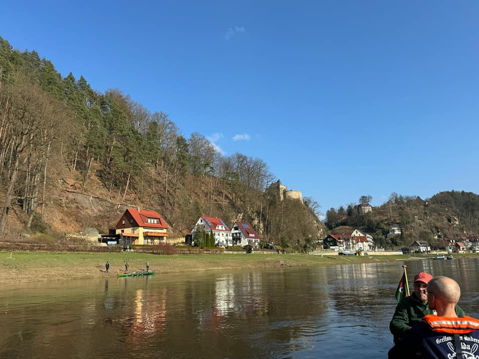

# 2. Advent Elb-Sandstein-Gebirge

## 05. - 07. Dezember 2025

Anreise am Freitagnachmittag mit 2 Kleinbussen nach Lovosice.
Am Samstag fahren wir durch das Elbsandsteingebirge nach Decin, wo wir im Aqua Hotel übernachten. Hier gibt es eine geheizten Außenpool (inklusive), alternativ Innenpool und Sauna (Aufpreis)

Den Sonntag  rudern wir weiter bis Pirna.

Wer am Freitag bereits etwas früher kann, fährt mit dem Hängertransport. Der 2. Bus startet gegen 16 Uhr.

Wir übernachten beide Nächte in Hotels.
Die Abendessen gehen auf eigene Rechnung.

Die Fahrt findet auch bei widrigen Wetterverhältnissen statt. Die Kleidung sollte dem angepasst sein. Lange Unterwäsche, Mützen und eventuell Handschuhe gehören zur Ausstattung der Ruderer. Für die Steuerleute sind Wintermäntel, Skianzüge oder Bärenfelle angemessen. Bitte unbedingt auch daran denken, dass jeder doppelte Ruderkleidung und Regenkleidung dabei hat.
