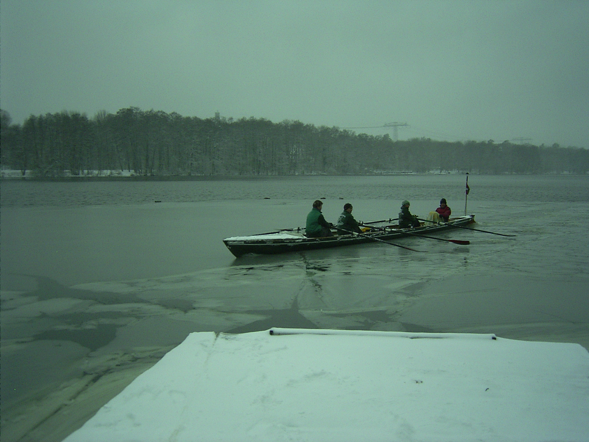

# Rudern zur Sitzung nach Birkenwerder

## 28.-30. November 2025

Anfängerfreundliche Wanderfahrt nach Spandau. Wir starten am Freitagnachmittag nach Spandau. Hier haben wir für 2 Nächte Quartier bei einem Ruderclub. (ca. 30 km)

Samstag rudern wir eine Tagestour nach Birkenwerder (ca. 30km).

Sonntag geht es wieder zurück nach Stahnsdorf (ca. 30 km).

2-3 Leute nehmen an der LRV- Versammlung in Birkenwerder teil, der Rest geht einfach rudern.

 
