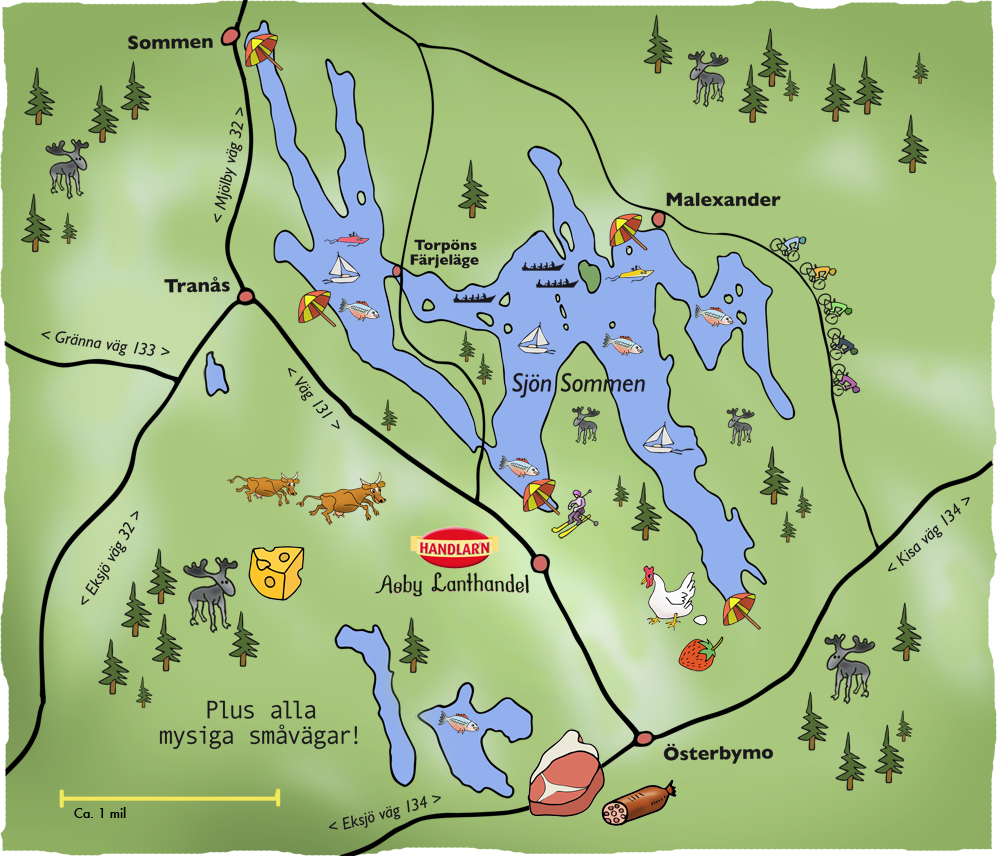

## 29. August - 07.September 2025

### Letzte Woche der Sommerferien

### auch für Wanderfahrt- Neulinge!

Gemütliche Wanderfahrt mit Standquartier am See Sommen in Östergötland.
Wir haben zwei direkt nebeneinanderliegende, rustikale Ferienhäuser mit insgesamt 12 Betten. Wir haben hier Standquartier und machen Tagesfahrten.
Die Etappen sind auch für fortgeschrittene Anfänger geeignet.
Für den Abend nehmen wir zusätzlich zwei Einer mit. Wer nach der Tagesetappe das Rudern im Einer ausprobieren möchte kann das hier gerne machen.

Die Hütten sind einfach ausgestattet. Es gibt keine Einzelzimmer. Wir werden selbst kochen und Frühstück machen. Alle Teilnehmer beteiligen sich am Küchendienst.
Falls ein versierter Hobby- Angler dabei ist, darf dieser gerne die Speisekarte bereichern.
Wir benötigen ein zusätzliches Fahrzeug, das ein Teilnehmer zur Verfügung stellen müsste.

Anreise erfolgt Freitag Abend per Nachtfähre ab Rostock. Wir werden gegen Samstag Mittag am Sommen sein. Rückreise eine Woche später Samstag Nachtfähre ab Trelleborg, Sonntag Mittag sind wir wieder in Stahnsdorf.
Es sind nur 5 Urlaubstage nötig. Die Fahrt liegt in den Berliner und Brandenburger Sommerferien.

Sommen (Wikipedia): Der Sommen ist ein 130 km² großer See in der schwedischen Provinz Östergötland (im Süden an Småland grenzend), etwa 40 km östlich des Vätternsees. Er ist bis zu 53 Meter tief und hat etwa 260 Inseln. Die Länge seiner Uferlinie beträgt etwa 449 km. Der größte Ort am See ist Tranås.
Der See ist bekannt für sein klares, nährstoffarmes Wasser, wobei man bei guten Verhältnissen bis zu 10 Meter in die Tiefe sehen kann.
