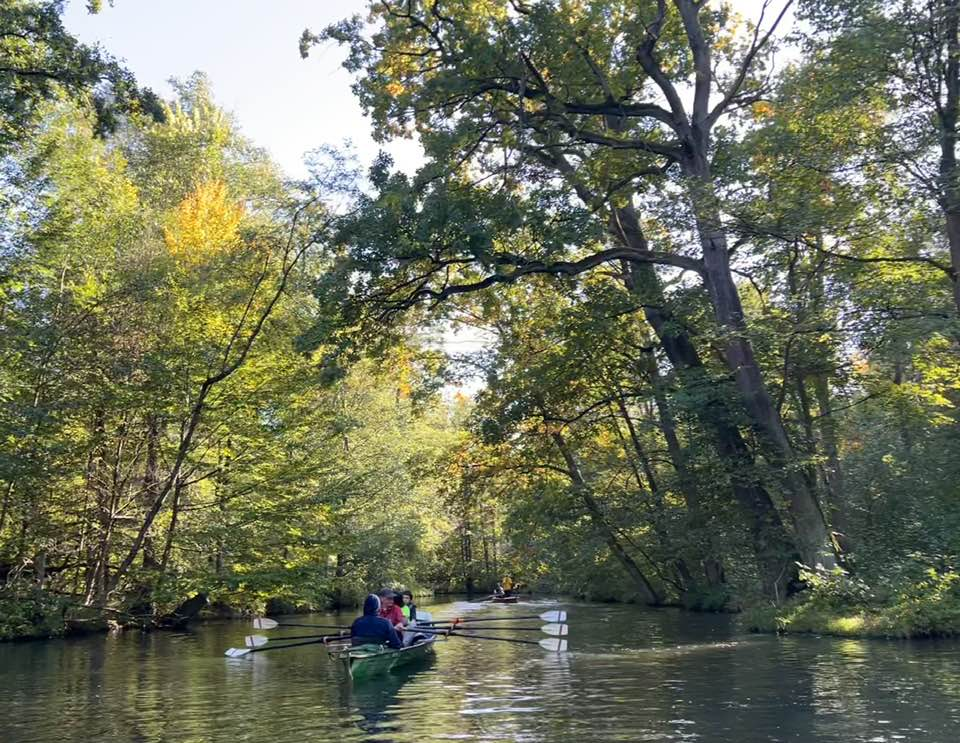

# Spreewaldfahrt Oktoberwochenende 2025

## 02. - 05. Oktober 2025

Anfängerfreundliche Wanderfahrt von Stahnsdorf in den Spreewald.

Donnerstagnachmittag rudern wir nach Grünau (30 km). Übernachtung in einem Ruderbootshaus auf Bettenquartier.
Am Feiertag geht es die Dahme aufwärts nach Prieros. (33 km). Hotelübernachtung
Samstag die Dahme weiter aufwärts und in den Unterspreewald (35-40 km) Hotelübernachtung
Sonntag drehen wir eine große Runde durch den Spreewald (ca. 30 km). Am Abend laden wir die Boote auf den Bootsanhänger und fahren per Auto zurück nach Stahnsdorf.

