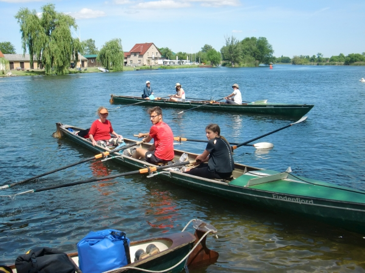

*Dieser Bericht wurde automatisch migriert*

Wenn Fehler auftreten oder links nicht funktionieren, dann schreiben Sie bitte eine Mail an website@wanderrudern.de, wir beheben das Problem gerne!

# Pfingstwanderfahrt 2020

Stahnsdorf - Havelberg

Unter weitestgehender Einhaltung der Corona- Vorschriften ging es Freitag mit Zweiern los. Über den Jungfernsee in den Sacrow- Paretzer- Kanal nach Ketzin.

Da allerdings ein Übernachten im Seesportclub nicht mehr möglich ist, machten wir am Anleger der Gemeinde fest, zahlten die horrenden Liegegebühren und stapften zu unser Pension in den Ort.

Auf jeden Fall ein empfehlenswertes Quartier und relativ preiswert. Da die Ferienwohnungen mit Küche ausgestattet waren, konnten wir selbst kochen.

Am nächsten Morgen ging es bei sonnigem Wetter die Havel weiter abwärts, zunächst bis Brandenburg. Unser Indisches Stammlokal Malabar war noch wegen Umbau geschlossen, aber “Essen to go” gab es. So saßen die Ruderer am Steg des Brandenburger Wasserwanderrastplatzes und genossen ihr Mittagessen.

Nach der Pause ruderten wir durch die Sportbootschleuse und dann über den Plauer See. Windig wie immer aber “nur” Nordwind, so dass man nach einigen windigen Kilometern unter Landdeckung gehen konnte.
Ziel war nicht der Ruderclub Plaue (geschlossen wegen Corona), sondern ein Hotel ein Stück weiter in Richtung Wusterwitz.

Günstig nur 100m vom Plauer Badestrand gelegen. Das günstig bezog sich leider nur auf die Lage, nicht auf den Preis. Darüber hinaus war eines der “Nichtraucherzimmer” derartig verraucht, dass wir das Hotel nur bedingt empfehlen können.

Da auch der lokale REWE Markt nicht weit war, konnten wir die Getränkevorräte auffüllen, während der Rest schon mal das Abendessen kochte.

Am nächsten Morgen hatten wir noch 1-2 Stunden etwas Wolken, danach brannte die Sonne gnadenlos vom Himmel. Bis zur ersten Schleuse war es noch recht voll mit Flößen und Privatmotorbooten, danach entspannte sich die Lage langsam und wir hatten den Fluss fast für uns alleine.

Die Havel ist hier wunderschön und hat einen relativ natürlichen Flusslauf.

Auch den Umweg über die Mögeliner Havel kann man empfehlen, wenn es auch eine Verkrautung an einer Stelle gab, wo man dann doch mal den Paddelhaken raus holen musste. Kein Vergleich zum Kanal Crasnicol im Donaudelta.

Auch in Rathenow konnten wir nicht zum Ruderclub. Daher ruderten wir weiter durch die Stadtschleuse. Unsere Ferienwohnungen lagen zwar direkt am Wasser, leider war hier in der Innenstadt kein Anlegen möglich.

Daher machten wir unsere Boote am “Wasserwanderstützpunkt” fest und spazierten die 500m zu den Ferienwohnungen.

Von außen wirkten die Häuser in denen die Wohnungen waren etwas eigenartig, aber die Wohnungen waren sehr schön und groß, so dass wir alle Leute unter bekamen.

Die letzte Etappe bis Havelberg war komplett in brennender Sonne, glücklicherweise gab es nur Sonnenbrand und keinen Sonnenstich.

Die Havel führt hier durch eine natürliche Auenlandschaft mit zahlreichen Nebenarmen. Das Boot des VL musste natürlich versuchen den Naturgenuss noch zu steigern, indem sie den Umweg über die Gülper Havel nahmen. Wirklich eine reizvolle Strecke. Nicht so reizvoll war die defekte Schleuse am Ende der Gülper Havel. Kein Schild, keine Sperrung, sie ließ sich auch bedienen, nur bis ins Oberwasser hochschleusen ließ sie sich nicht.

Damit war umtragen angesagt. Im Unterwasser trudelten kurz darauf die anderen Boote ein. Es wurde eine längere Pause am Strand bei Strodehne gemacht, bevor wir uns auf die finale Etappe nach Havelberg machten.

Praktisch zeitgleich mit den Booten trafen unsere beiden Kleinbusse mit dem Anhänger ein.

Die Boote wurden aufgeladen und die Leute nach Hause verfrachtet, um ihre Sonnenbrände zu pflegen.
