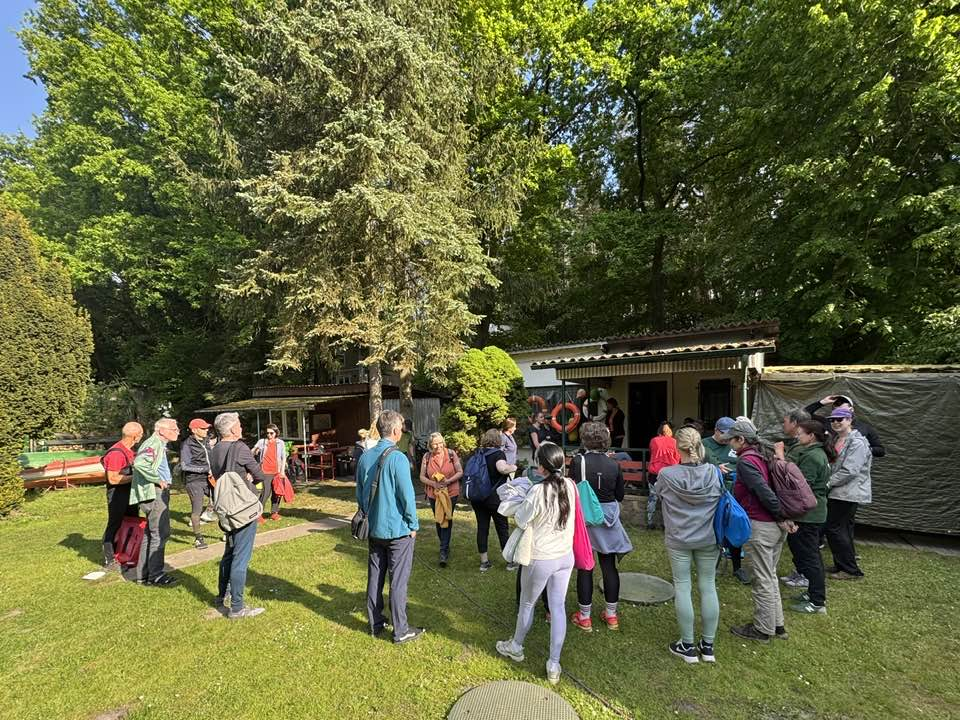

# Anfänger- Ruderkurs für Erwachsene

Nach unserem gut besuchten Tagen der offenen Tür Anfang Mai, hatten wir 30 Anmeldungen für den Anfängerkurs der Erwachsenen, so viele wie noch nie.

Die meisten Teilnehmer haben die 10 Rudertermine durchgehalten, so dass wir, nach dem Kurs viele neue Mitglieder begrüßen konnten.

Nach den Sommerferien findet ein weiterer Anfängerkurs für Jugendliche statt.
