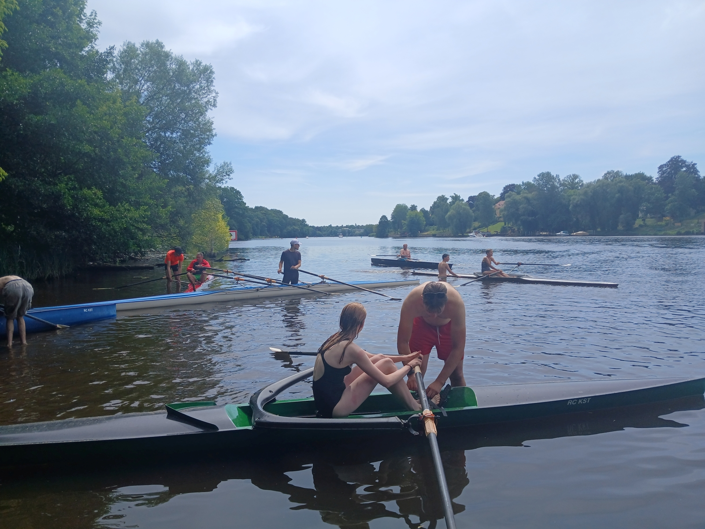
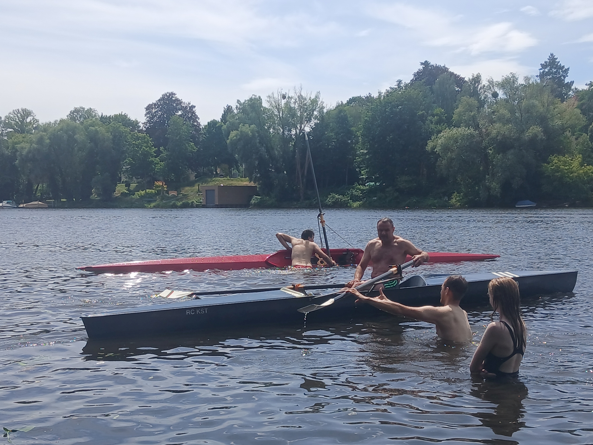

# Einer Training am Griebnitzsee

Wanderruderer rudern nicht so oft in schmalen Einern.

Daher unser Einer-Trainingskurs am Griebnitzsee, FunTrainer (60cm), GigRacer (47cm), Skiff (37cm). 
Je schmaler, desto kippempfindlicher.
Bevor man mit solchen Booten aufs Wasser geht, sollte man wissen wie man nach eine Kenterung wieder einsteigt.

Das Training erfolgte vor einem Strand am Griebnitzsee. Vor dem Steg geht so etwas bei uns nicht, sonst trifft den Schleusenwart der Schlag.

