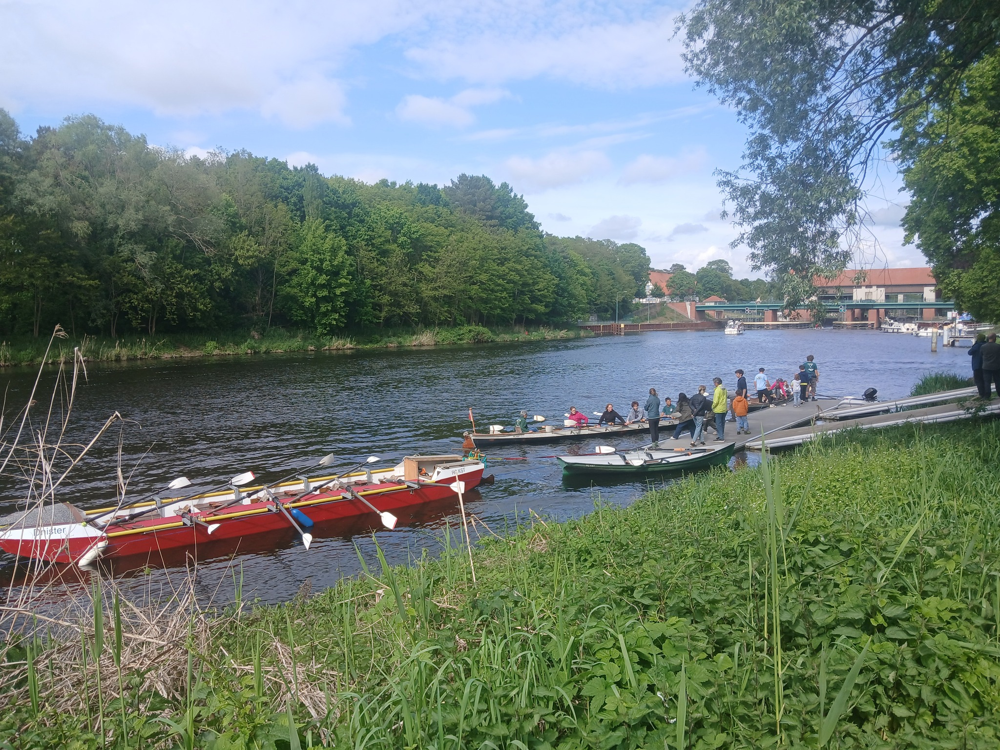
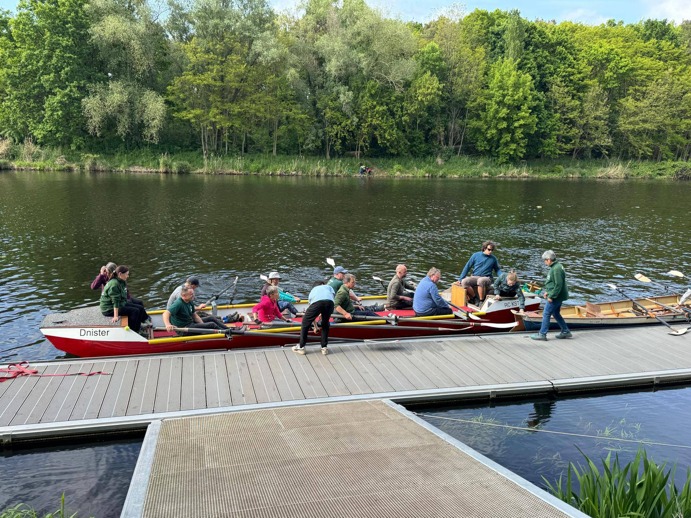
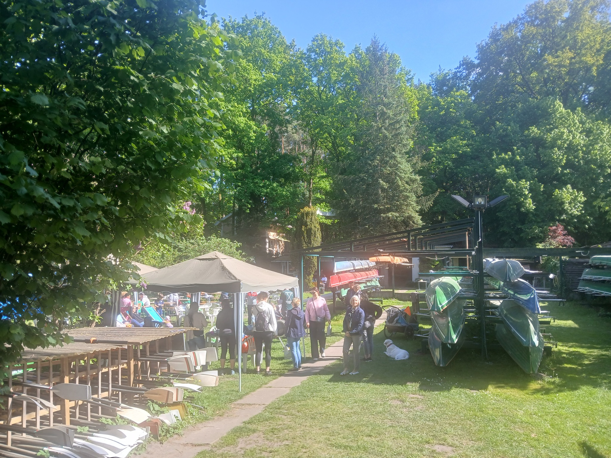

Anfang Mai fanden unsere Tage der offenen Tür statt. Bei bestem Wetter fanden zahlreiche Besucher den Weg auf unser Clubgelände am Teltowkanal.
Samstag und Sonntag waren pausenlos 4-5 Boote im Einsatz, um allen Gästen das Proberudern zu ermöglichen.
Unser Catering- Team war auch gut beschäftigt damit niemand hungrig oder durstig blieb.
Wir hoffen, dass es allen gefallen hat und wir zahlreiche neue Ruderer gewonnen haben.

Mit 30 Anmeldungen für den folgenden Anfängerkurs sind unsere Obleute auf jeden Fall erst einmal gut beschäftigt.

Auch unsere Barke war natürlich im Einsatz

Auf jeden Fall hat der neue Steg die Abläufe erheblich erleichtert. Weniger Gedrängel und niemand drohte ins Wasser zu fallen.

Wegen des guten Wetters musste nicht einmal das Festzelt aufgebaut werden.
