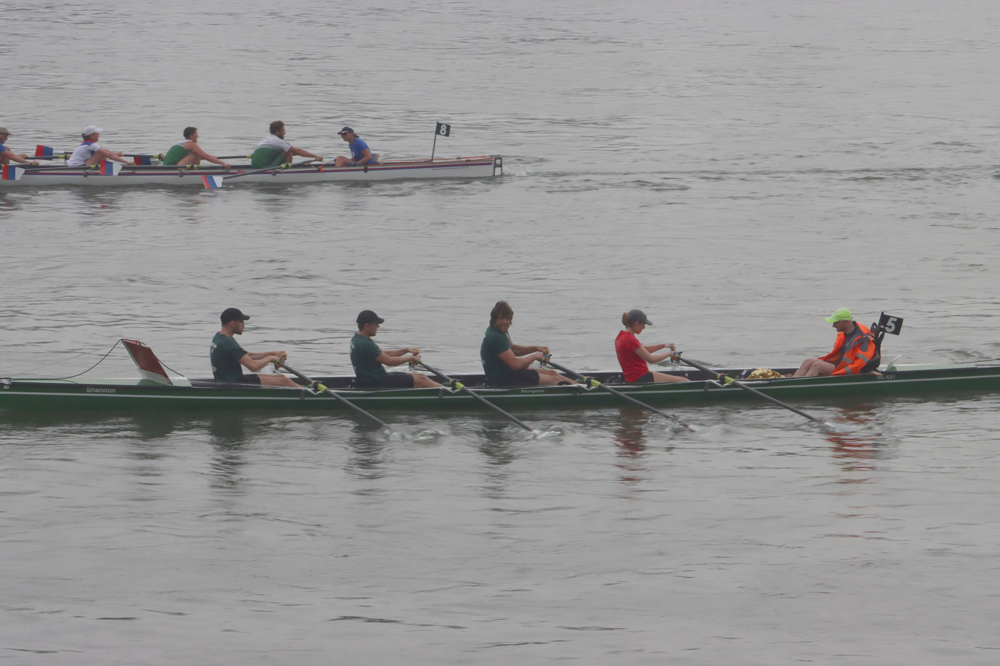
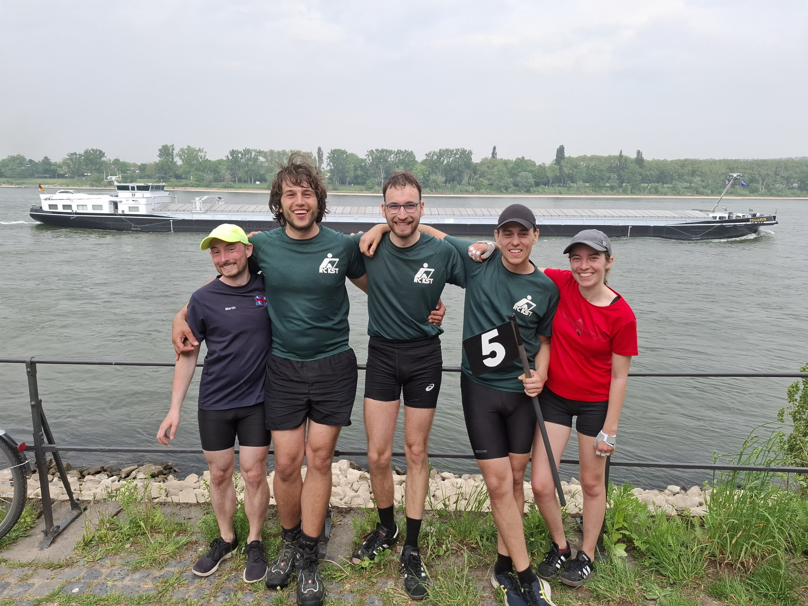

Parallel zur EUREGA lief vom KST noch eine Wanderfahrt auf der Lahn, bei der wir uns für den ersten Rudertag (Donnerstag) einklinkten.
Am Freitag frühstückten wir noch mit der restlichen Rudermannschaft.
Nachdem die Boote abgefahren waren, machten wir uns mit dem Hänger auf den Weg zum Einsatzort Sankt Goar.
Im Unterschied zu den letzten Jahren waren wir auf einem Campingplatz auf der linksrheinischen Seite untergebracht, weswegen wir die Entscheidung getroffen hatten, unser Boot auch auf dieser Seite auf dem Grundstück des Wassersportverein St. Goar 1924 e.V. vorzubereiten.
Wir luden die Shannon also dort ab und bereiteten sie, soweit es ging, vor.

Nach dem Einkaufen ging zum Campingplatz um uns bei der Rennleitung anzumelden.
Wir trafen dort auf unsere Mitrudernden Marvin und Mila vom Oldenburger Ruderverein (ORVO), die getrennt angereist waren.
Nachdem die Zelte aufgebaut waren, wurde das traditionelle Nudelessen veranstaltet; und anschließend die Sicherheitseinweisung für die Regatta gegeben.

Nach einer (hoffentlich) halbwegs erholsamen Nacht wurde beim Frühstück das letzte Essen für das Boot vorbereitet, die Zelte abgebaut, alles zusammengepackt und im eigenen Auto oder beim Landdienst der ORVOs deponiert.
Nach dem Einsetzen ging es zum Start; also ein paar hundert Meter den Rhein aufwärts und auf die andere Seite des Rheins. So bekamen wir zumindest noch einmal die Möglichkeit, ein paar Meter vor der Regatta alle gemeinsam gefahren zu sein.

Dieses Jahr starteten wir im hinteren Mittelfeld.
Somit hatten wir die meiste Zeit genügend Boote vor uns, um uns zu motivieren.
Das Wetter war, bis auf ein paar Tropfen, mit angenehmen Temperaturen und bewölktem Himmel sehr gnädig zu uns.
Ca. 20 Kilometer vor dem Ziel holte uns der QuadTiger ein, was unsere Mannschaft noch einmal immens motivierte.
Wir lieferten uns ein erbittertes Rennen, das bis zur Ziellinie anhielt und bei dem am Ende auch die Mannschaft "Row with the Flow" mit einstieg.

Das Boot ging als viertes in der Gesamtwertung und als drittes in unserer Klasse (Männer) mit einer Zeit von 5:39:09 in Bonn über die Ziellinie.
Nachdem das Boot aus dem Wasser gebracht war, ging es für uns vor allem um das abbauen des Bootes, während Felix vom Landdienst der Lahn-Wanderfahrenden eingesammelt und zurück nach Sankt Goar gebracht wurde, um den Bootshänger und unser Gepäck nach Bonn zu holen.
Ein Dankeschön gilt ihm dafür, dass er die über drei Stunden Autofahrt auf sich nahm und damit die weitere Organisation deutlich erleichterte.
Während des Abbauens brach auch das Gewitter, das sich bereits angekündigt hatte, über uns hinein, aber: Hauptsache nicht während des Ruderns!

Nachdem wir das Boot und uns sortiert hatten und die Preise verliehen waren, warteten wir auf Felix, legten die Shannon in den Hänger und brachten dann unser Gepäck
zum Akademischen Ruderclub Rhenus Bonn, bei dem wir dieses Jahr wieder übernachten durften.
Um noch etwas herzhaftes im Magen zu haben, wurde, wie die letzten Jahre auch, Pizza bestellt und nach eintreffen auf einer Bank am Wasser mit Blick auf die vorbeifahrenden Ausflugsschiffe genossen.

Der Sonntag verlief ruhig. Nach dem Frühstück verabschiedeten wir uns von Marvin und Mila, die per Bahn nach Oldenburg zurück fuhren.
Wir warteten in Ruhe auf die Lahn-Wanderfahrer, deren Ziel auch Bonn sein sollte. Kurz nachdem der Landdienst sein Ziel erreichte, war auch das erste Boot auf dem Rhein zu sehen.

Nachdem alle Boote abgeriggert, aufgeladen und das Zubehör verstaut war, fuhren wir mit den Teilnehmern der Wanderfahrt zurück nach Berlin.

Ein besonderer Dank gilt Stefan, der uns erlaubte, einen Platz auf dem Hänger für unser Boot zu nutzen, sodass wir mit wenig Mehraufwand an der EUREGA teilnehmen konnten.

