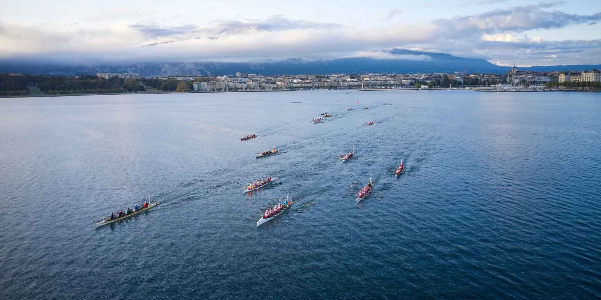
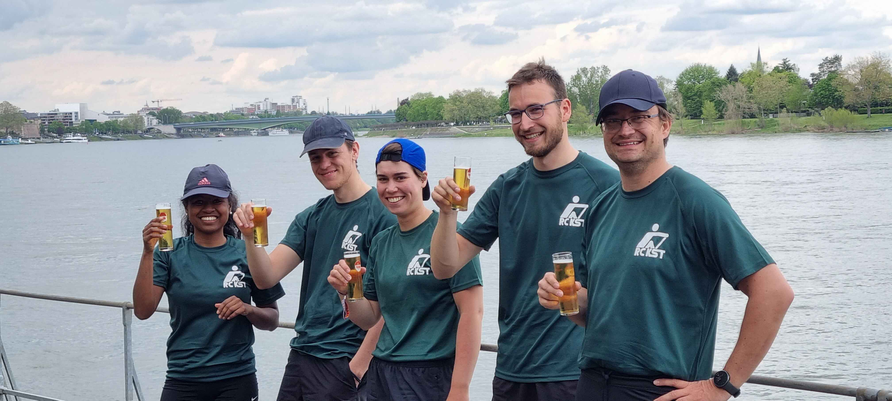

---
images:
- src: images/eurega_bootsaustattung.jpg
  title: Eurega Bootsaustattung
- src: images/genf_2023_alle_boote.jpg
  title: Genf 2023 alle Boote
- src: images/genf_2023_wir_geben_alles.jpg
  title: Genf 2023
- src: images/hart_van_holland_easterbunnies.jpg
  title: Easterbunnies
- src: images/oste_marathon_2022_pause_auf_der_sandbank.jpg
  title: Ostemarathon auf der Sandbank
- src: images/oste_marathon_2022_sieger.jpg
  title: Ostemarathon als Sieger
- src: images/oste_marathon_vierter_platz_der_ah.jpg
  title: Ostemarathon - 4. Platz der AH
- src: images/Patrik_als_sieger_des_Rheinmarathon_2015.jpg
  title: Patrik als Sieger des Rheinmarathon 2015
- src: images/rheinmarathon_2018_mannschaft.jpg
  title: Rheinmarathon 2018 Mannschaft
- src: images/WhatsApp_Image_2023-10-07_at_20.04.13.jpeg
  title: Nach dem Zieleinlauf bei Quer durch Berlin
- src: images/WhatsApp_Image_2023-10-26_at_18.05.35.jpeg
  title: Preisverleihung Genf 2023
title: Marathonrudern
weight: 10
---

Seit 2018 gibt es beim RC KST eine kleine Gruppe motivierter größtenteils junger Ruderinnen und Ruderer, die sich dem Marathonrudern verschrieben haben. Seitdem ist sowohl die Gruppe als auch die Anzahl der besuchten Regatten langsam, aber stetig angestiegen und das Marathonrudern ist zu einer festen Sparte des Vereins geworden. Sehr ehrgeizige Mannschaften erruderten dabei bereits Siege unter anderem bei der inoffiziellen Weltmeisterschaft des Ultra-Langstreckenruderns.  ([2022](/berichte/2022/tour_du_lac_leman_2022/index.md), [2023](../../berichte/2023/tour_de_lac_leman_2023/index.md), [2024](../../berichte/2024/tour_du_lac_leman_20241/index.md)).

Unser Motto ist dabei immer „100% Geben - Dabei sein ist alles!“

Aktuell suchen wir motivierte Verstärkung für unser Team, hauptsächlich in den Altersgruppen 18-40 Jahre.

# Was ist eigentlich Marathonrudern?
Als Marathonrudern bezeichnet man eine Extremform des Rudersports, bei der Marathondistanzen  auf Zeit zurückgelegt werden. Gewissermaßen ist das Marathonrudern damit eine Hybridform zwischen Wanderrudern und Wettkampfrudern. Typischerweise werden Strecken von 42 km bis hin zu Ultra-Langstecken von 160 km oder im Extremfall sogar 200 km gerudert. Dabei gilt es die Balance zwischen Kraft, Ausdauer und mentaler Stärke zu finden um sich bis zu 24 Stunden am Stück motiviert und fokussiert zu halten. In Deutschland und einigen umliegenden europäischen Ländern gibt es einen kleinen, aber harten Kern an Marathonruderinnen und -ruderern. Obwohl das Marathonrudern eher eine Nischensportart, die insbesondere im Rheinland verbreitet ist, gibt es jedes Jahr unzählige kleinere und größere Veranstaltungen mit familiärem Charakter. 

### Wer sind wir?
Beim RC KST steht seit jeher wie in keinem anderen Verein bundesweit das Wanderrudern im Vordergrund. So ist es nicht verwunderlich, dass alle bisherigen Mitglieder der vereinsinternen Marathongruppe ihre Wurzeln im Wanderrudern haben. Aktuell sind wir eine gemischte Gruppe aus 17- bis Mitte 50-jährigen Ruderbegeisterten, die teilweise schon mehrere Jahrzehnte Wanderrudererfahrung haben. Im Gegenteil dazu ist das die Teilnahmen an Marathonregatten für uns eher Neuland - eine spannende neue Art den unglaublich facettenreichen Rudersport zu betreiben. Da wir das Rudern alle prinzipiell nebenbei als Hobby betreiben, ist es uns wichtig, dem Verein treu zu bleiben. Das heißt, dass Wanderfahrten bei uns weiterhin einen großen Stellenwert einnehmen und wir diese auch ganz konkret in die Vorbereitungen für das Marathonrudern integrieren.

### Was haben wir bis jetzt gemacht?
Seit 2018 haben wir an unterschiedlichen Marathon-Regatten teilgenommen, unter anderem: Rhein-Marathon, EUREGA, Traditionswochenende auf der Oste, Tour du Léman á l'aviron (Genfer See), Hart van Holland, Quer durch Berlin ([Übersicht](/typen/marathon)). Dabei haben wir zu Beginn erst einmal einige Marathonprinzipien erlernen müssen, aber vor allem unglaublich wertvolle Erfahrungen gemacht, tolle  Menschen kennengelernt und Motivation für zukünftige Marathon-Regatten gesammelt.

### Was sind unsere Ziele?
Wir möchten unsere Marathonrudergruppe erweitern, um zukünftig noch mehr Präsenz auf deutschen und europäischen Marathonregatten zu zeigen. Im Vordergrund stehen bei uns ganz klar Spaß und Teamgeist. Unser Ziel ist es, Mannschaften je nach persönlicher Ambition zusammenzustellen und im Rahmen der sportlichen Möglichkeiten jeder und jedes Einzelnen das Beste rauszuholen. Hierbei wollen wir primär mit unserem Know-How der zahlreichen Wanderfahrten und ersten Erfahrungen von Marathonregatten den Einstieg in die Marathonwelt je nach Ambition der Mannschaften sowohl in sportlicher als auch organisatorischer Hinsicht unterstützen.

Wenn nach der Regatta die gesamte Mannschaft komplett erschöpft, aber mit einem Lächeln auf den Lippen aus dem Boot steigt und sich im Anschluss direkt nach dem Termin fürs nächste Jahr erkundigt, dann haben wir alles richtig gemacht. Wenn wir mit dieser Einstellung auch noch den einen oder anderen Pokal gewinnen können - umso besser.

### Wer kann bei uns mitmachen?
Aktuell suchen wir gezielt junge Ruderbegeisterte zwischen 18 und 40 Jahren, prinzipiell finden wir aber für jede Altersgruppe den richtigen Platz. Wer bei uns mitrudern möchte, sollte idealerweise bereits seit einigen Jahren sicher rudern können und bereits erste Erfahrung im Rudern von längeren Strecken (also Teilnahme an Wanderfahrten oder ähnlichem) haben.

Am wichtigsten sind jedoch die Motivation, an seine körperlichen Grenzen zu gehen, Lernbereitschaft und Teamfähigkeit - alle anderen Fähigkeiten rund ums Rudern lassen sich auch gemeinsam mit uns erarbeiten.

Für die Teilnahme an Regatten auf strömendem Gewässer setzten wir mindestens eine Teilnahme an einer Wanderfahrt des RC KST auf strömendem Gewässer voraus.

### Wie läuft das Rudern / Training bei uns ab?
Wir halten uns das ganze Jahr über selbstständig fit. Dies kann mit Hilfe der Trainingsfahrten des RC KST unter der Woche (20-30km) wie auch an den Wochenenden (20-100km) erreicht werden. Vor den Regatten treffen wir uns gezielt in der Mannschaft, um gemeinsam an Technik und Synchronität zu arbeiten.

Zusätzlich nehmen wir regelmäßig an Wanderfahrten des RC KST teil, gerade an solchen, bei denen höhere Kilometerleistungen erbracht werden. Die Teilnahme an Wanderfahrten legt die konditionellen Grundlagen, die uns das Rudern über lange Strecken ermöglichen und stellt gleichzeitig eine gute Möglichkeit zum Teambuilding dar.

[Hier geht es zu den Trainingsterminen + Wanderfahrten + Regatten 2024](/ausschreibungen/2024/marathontermine.md)

Im Vorfeld vor Regatten entscheiden die einzelnen Mannschaften individuell, in welchem Umfang sie sich auf die Regatta vorbereiten wollen. Dies kann von nur 3 gemeinsamen Ruderterminen bis hin zu einer mehr-monatigen Vorbereitungszeit mit monatlich 2 Langstrecken- und mehreren Kurzstrecken-Trainings reichen. Die Bereitschaft für die eine oder die andere Art der Vorbereitung entscheidet dabei über die Zusammensetzungen der Mannschaften.

Grundsätzlich organisieren und trainieren wir uns selbst. Das heißt wir haben aktuell keine Trainerin / keinen Trainer vor Ort. Nichtsdestotrotz wollen wir uns auch technisch stetig weiterentwickeln. Gute Kommunikation und Teamfähigkeit sind hier entscheidend für eine erfolgreiche Zusammenarbeit. Dabei spielt das Begegnen auf Augenhöhe eine zentrale Rolle.

Für Ambitioniertere des RC KST, die spezifisch ihre Technik weiter entwickeln wollen, stehen wir auch im engen Kontakt zu unserem externen Mitglied Patrik Sassin (Trainer B – Rudern Leistungssport, 2. Lizenzetsufe), der uns als Spezialist für Ultra-Langstreckenwettkämpfe aus der Marathonhochburg am Rhein sowohl zur Marathonrudertechnik als auch zu allem anderen beratend zur Seite steht. Es besteht auch die Möglichkeit, Videoaufnahmen gemeinsam im Nachhinein mit ihm oder als Team allein zu analysieren.

Fragen?

Wir KSTler (Nirina, Johanna, Paul, Tim) stehen gerne für Fragen bereit und freuen uns über alle, die mit uns in einem Boot sitzen oder Marathonwettkämpfe gegen uns bestreiten. Für Ideen und Anregungen haben wir immer ein offenes Ohr.

Fragen und Anregungen bitte an Nirina: ([](mailto:)).

Gerne organisieren wir auch vereinsübergreifenden Bootstransporte zu Marathonregatten.




